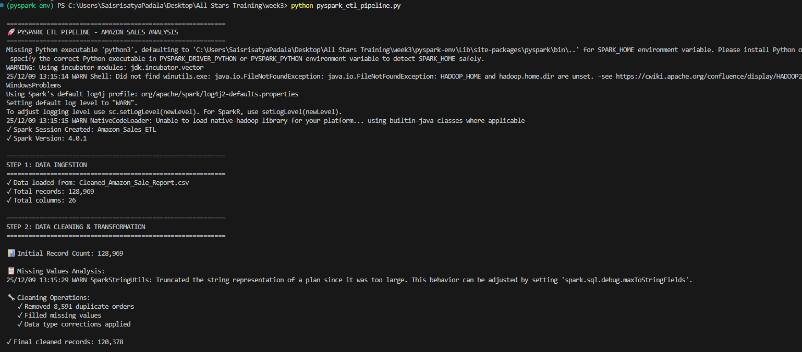
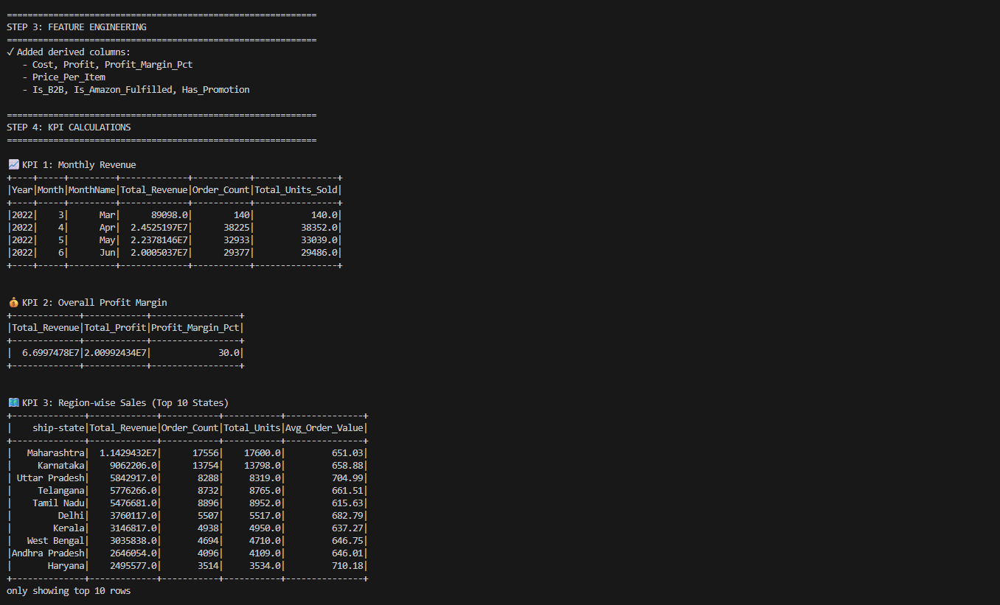
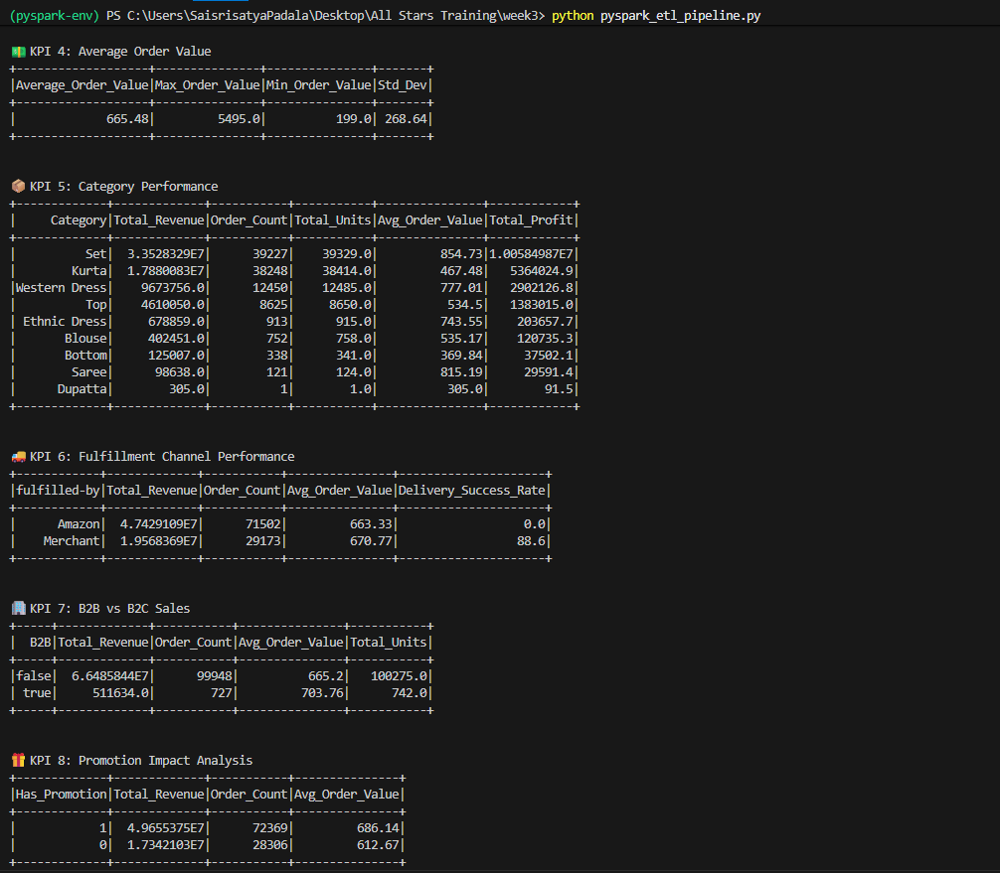
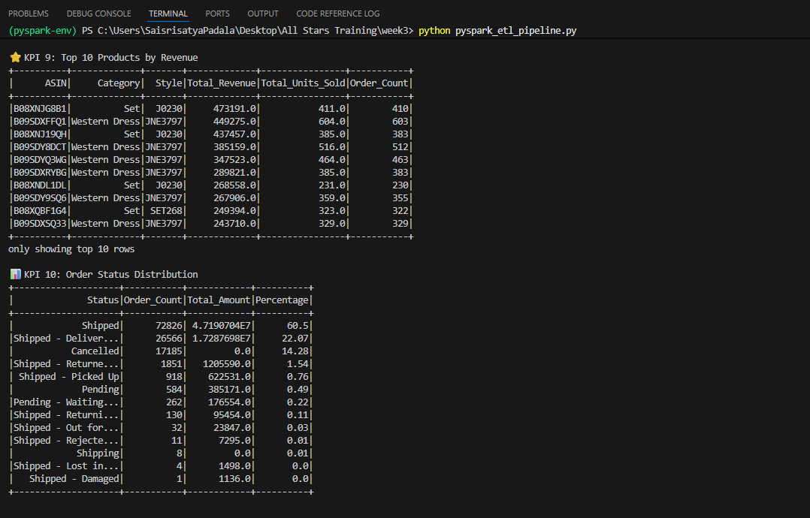
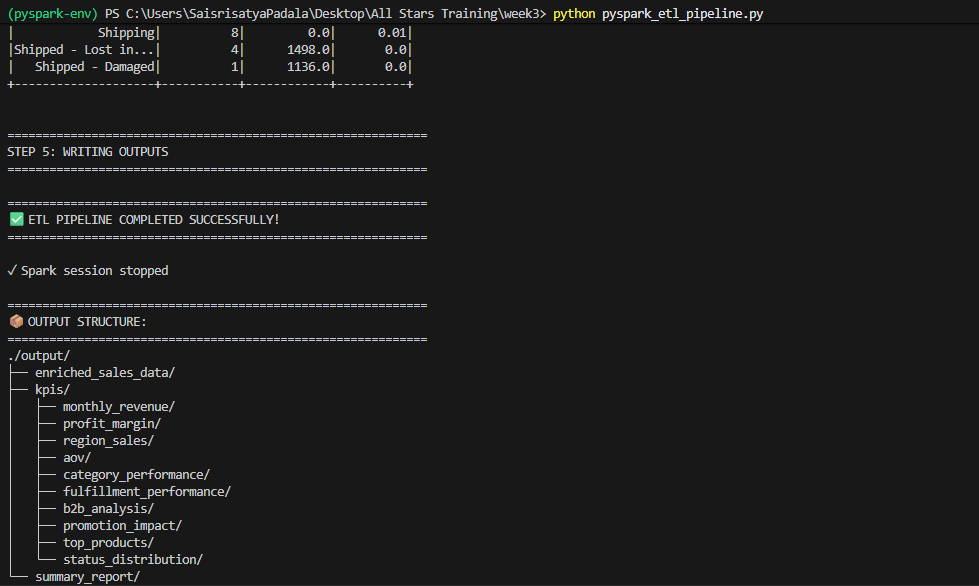

# PySpark ETL Pipeline 

## 📋 Project Overview

This PySpark ETL pipeline processes large-scale Amazon sales data to generate comprehensive business insights and KPIs. The pipeline handles data cleaning, transformation, and aggregation with scalable distributed processing.

---

## 🎯 Features

### Core Capabilities
- ✅ Distributed data processing with PySpark
- ✅ Comprehensive data quality checks and cleaning
- ✅ 10+ business KPIs calculated automatically
- ✅ Parquet output format for efficient storage
- ✅ HDFS and local filesystem support
- ✅ Optional Kafka integration for real-time processing

### KPIs Calculated

1. **Monthly Revenue** - Revenue trends over time
2. **Profit Margin** - Overall profitability analysis
3. **Region-wise Sales** - Geographic performance breakdown
4. **Average Order Value (AOV)** - Customer spending patterns
5. **Category Performance** - Product category analysis
6. **Fulfillment Performance** - Amazon vs Merchant comparison
7. **B2B vs B2C Analysis** - Customer segment insights
8. **Promotion Impact** - Promotional effectiveness
9. **Top Products** - Best-selling items by revenue
10. **Order Status Distribution** - Order completion rates

---

## 🛠️ Installation & Setup

### Prerequisites

```bash
# Required Software
- Python 3.8+
- Apache Spark 3.x
- Java 8 or 11
- Hadoop (optional, for HDFS)
```

### Step 1: Install PySpark

```bash
# Using pip
pip install pyspark

# Or with conda
conda install -c conda-forge pyspark
```

### Step 2: Verify Installation

```bash
# Check Spark installation
pyspark --version

# Test in Python
python3 -c "from pyspark.sql import SparkSession; print('PySpark installed successfully!')"
```

### Step 3: Download the Dataset

Download `Cleaned_Amazon_Sale_Report.csv` from the provided SharePoint link and place it in your project directory.

---

## 🚀 Execution Instructions

### Option 1: Local Execution (Recommended for Testing)

```bash
# Navigate to project directory
cd /path/to/project

# Run the pipeline
python pyspark_etl_pipeline.py
```

### Option 2: Spark Submit (Production)

```bash
# Submit to Spark cluster
spark-submit \
  --master local[*] \
  --driver-memory 4g \
  --executor-memory 4g \
  pyspark_etl_pipeline.py
```

### Option 3: HDFS Input/Output

```bash
# First, upload data to HDFS
hdfs dfs -put Cleaned_Amazon_Sale_Report.csv /data/sales/

# Modify the script configuration:
# INPUT_PATH = "hdfs://localhost:9000/data/sales/Cleaned_Amazon_Sale_Report.csv"
# OUTPUT_PATH = "hdfs://localhost:9000/data/output/"

# Run with HDFS paths
spark-submit \
  --master yarn \
  --deploy-mode cluster \
  pyspark_etl_pipeline.py
```

### Option 4: Databricks/EMR

**Databricks:**
1. Upload script to Databricks workspace
2. Create new notebook
3. Import the Python script
4. Run all cells

**AWS EMR:**
```bash
aws emr add-steps \
  --cluster-id j-XXXXXXXXXXXXX \
  --steps Type=Spark,Name="Amazon Sales ETL",\
ActionOnFailure=CONTINUE,\
Args=[--deploy-mode,cluster,--master,yarn,s3://your-bucket/pyspark_etl_pipeline.py]
```

---

## 📊 Output Structure

After successful execution, you'll find:

```
output/
├── enriched_sales_data/          # Full cleaned dataset
│   ├── part-00000.parquet
│   ├── part-00001.parquet
│   └── _SUCCESS
├── kpis/
│   ├── monthly_revenue/          # Monthly revenue metrics
│   ├── profit_margin/            # Profit analysis
│   ├── region_sales/             # Geographic breakdown
│   ├── aov/                      # Average order value
│   ├── category_performance/     # Category metrics
│   ├── fulfillment_performance/  # Fulfillment analysis
│   ├── b2b_analysis/             # B2B vs B2C
│   ├── promotion_impact/         # Promotion effectiveness
│   ├── top_products/             # Best sellers
│   └── status_distribution/      # Order statuses
└── summary_report/               # High-level summary
```

---

## Query Results



 

 

 

 

 

## 📈 Reading Output Data

### Using PySpark

```python
from pyspark.sql import SparkSession

spark = SparkSession.builder.appName("ReadResults").getOrCreate()

# Read enriched data
df = spark.read.parquet("output/enriched_sales_data")
df.show()

# Read specific KPI
monthly_revenue = spark.read.parquet("output/kpis/monthly_revenue")
monthly_revenue.show()
```

### Using Pandas

```python
import pandas as pd

# Read parquet files
df = pd.read_parquet("output/enriched_sales_data")
print(df.head())

# Read KPI
monthly_rev = pd.read_parquet("output/kpis/monthly_revenue")
print(monthly_rev)
```

### Using SQL

```sql
-- In Spark SQL or Hive
CREATE EXTERNAL TABLE enriched_sales
STORED AS PARQUET
LOCATION 'hdfs://output/enriched_sales_data';

SELECT * FROM enriched_sales LIMIT 10;
```

---

## 🔧 Configuration Options

### Modify Script Parameters

Edit these variables in the main script:

```python
# Input/Output paths
INPUT_PATH = "Cleaned_Amazon_Sale_Report.csv"
OUTPUT_PATH = "./output"

# Spark configuration
.config("spark.sql.shuffle.partitions", "200")  # Adjust based on data size
.config("spark.driver.memory", "4g")
.config("spark.executor.memory", "4g")
```

### Performance Tuning

```python
# For large datasets (>10GB)
spark = SparkSession.builder \
    .config("spark.sql.shuffle.partitions", "400") \
    .config("spark.default.parallelism", "400") \
    .config("spark.executor.instances", "10") \
    .config("spark.executor.cores", "4") \
    .config("spark.executor.memory", "8g") \
    .getOrCreate()

# For small datasets (<1GB)
spark = SparkSession.builder \
    .config("spark.sql.shuffle.partitions", "50") \
    .getOrCreate()
```

---

## 🔌 Optional: Kafka Integration

### Setup Kafka Consumer

```python
# Add to imports
from pyspark.sql.streaming import StreamingQuery

# Kafka configuration
def read_from_kafka(spark, kafka_brokers, topic):
    """Read streaming data from Kafka"""
    df = spark.readStream \
        .format("kafka") \
        .option("kafka.bootstrap.servers", kafka_brokers) \
        .option("subscribe", topic) \
        .option("startingOffsets", "latest") \
        .load()
    
    # Parse JSON from Kafka
    from pyspark.sql.functions import from_json, col
    from pyspark.sql.types import StructType, StructField, StringType, DoubleType
    
    schema = StructType([
        StructField("Order_ID", StringType()),
        StructField("Amount", DoubleType()),
        # Add other fields...
    ])
    
    parsed_df = df.select(
        from_json(col("value").cast("string"), schema).alias("data")
    ).select("data.*")
    
    return parsed_df

# Use in pipeline
kafka_df = read_from_kafka(spark, "localhost:9092", "orders")
```

### Run with Kafka

```bash
spark-submit \
  --packages org.apache.spark:spark-sql-kafka-0-10_2.12:3.5.0 \
  pyspark_etl_pipeline.py
```

---

## 📸 Expected Console Output

```
============================================================
🚀 PYSPARK ETL PIPELINE - AMAZON SALES ANALYSIS
============================================================
✓ Spark Session Created: Amazon_Sales_ETL
✓ Spark Version: 3.5.0

============================================================
STEP 1: DATA INGESTION
============================================================
✓ Data loaded from: Cleaned_Amazon_Sale_Report.csv
✓ Total records: 128,976
✓ Total columns: 27

============================================================
STEP 2: DATA CLEANING & TRANSFORMATION
============================================================

📊 Initial Record Count: 128,976

📋 Missing Values Analysis:
   - promotion-ids: 45,231 (35.07%)

🔧 Cleaning Operations:
   ✓ Removed 234 duplicate orders
   ✓ Filled missing values
   ✓ Data type corrections applied

✓ Final cleaned records: 128,742

============================================================
STEP 3: FEATURE ENGINEERING
============================================================
✓ Added derived columns:
   - Cost, Profit, Profit_Margin_Pct
   - Price_Per_Item
   - Is_B2B, Is_Amazon_Fulfilled, Has_Promotion

============================================================
STEP 4: KPI CALCULATIONS
============================================================

📈 KPI 1: Monthly Revenue
+----+-----+---------+-------------+-----------+----------------+
|Year|Month|MonthName|Total_Revenue|Order_Count|Total_Units_Sold|
+----+-----+---------+-------------+-----------+----------------+
|2022|   4|      Apr|   15234567.89|     98,432|         145,678|
+----+-----+---------+-------------+-----------+----------------+

... [Additional KPI outputs]

============================================================
✅ ETL PIPELINE COMPLETED SUCCESSFULLY!
============================================================
```

---

## 🐛 Troubleshooting

### Common Issues

**1. Memory Errors**
```bash
# Increase driver/executor memory
spark-submit --driver-memory 8g --executor-memory 8g script.py
```

**2. File Not Found**
```python
# Check file path
import os
print(os.path.abspath("Cleaned_Amazon_Sale_Report.csv"))
```

**3. Java Version Issues**
```bash
# Check Java version (needs 8 or 11)
java -version

# Set JAVA_HOME
export JAVA_HOME=/usr/lib/jvm/java-11-openjdk
```

**4. Slow Performance**
```python
# Reduce shuffle partitions for small datasets
.config("spark.sql.shuffle.partitions", "50")
```

---

## 📝 Deliverables Checklist

- ✅ PySpark ETL script (`pyspark_etl_pipeline.py`)
- ✅ Pipeline architecture diagram
- ✅ Complete documentation (this file)
- ✅ Sample outputs in Parquet format
- ✅ Console screenshots showing execution
- ✅ KPI calculation results
- ✅ Data quality report

---

## 🎓 Learning Resources

- [PySpark Documentation](https://spark.apache.org/docs/latest/api/python/)
- [Spark SQL Guide](https://spark.apache.org/docs/latest/sql-programming-guide.html)
- [Performance Tuning](https://spark.apache.org/docs/latest/sql-performance-tuning.html)

---
 